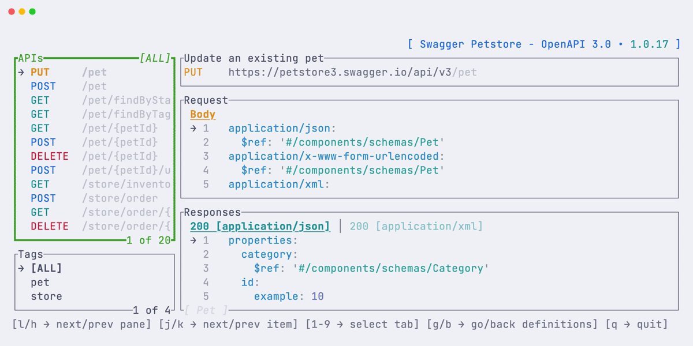
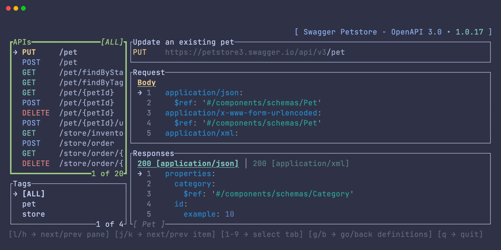
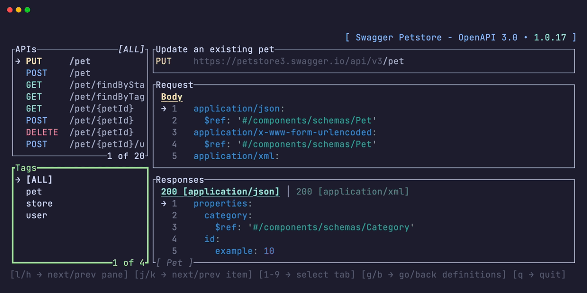
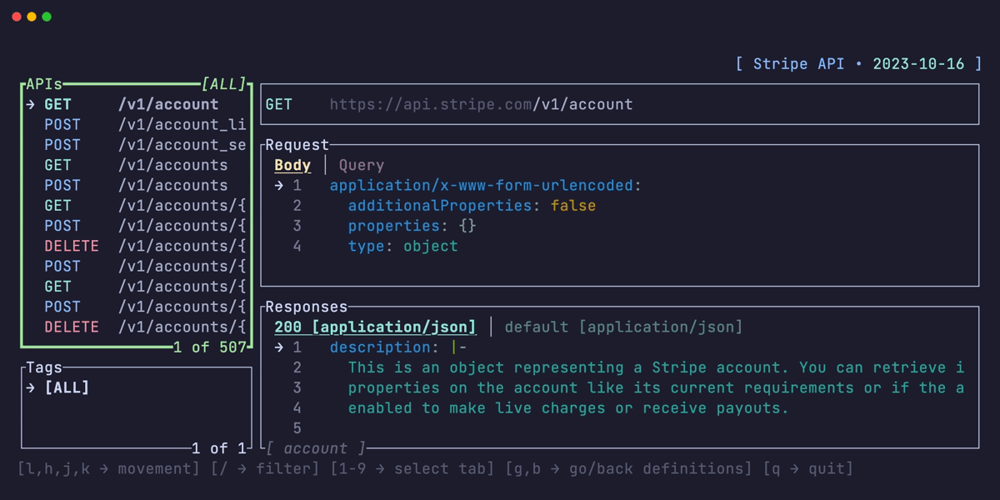

# openapi-tui

[](https://github.com/zaghaghi/openapi-tui/actions)

Terminal UI to list, browse and run APIs defined with OpenAPI v3.0 spec.

# Demo


## Nested Components


## Fullscreen


## Webhooks


## Filter


# Installation
Install from source:
```bash
❯ cargo install openapi-tui
```
Or download pre-built artifact from release page.

## Distro Packages

<details>
  <summary>Packaging status</summary>

[](https://repology.org/project/openapi-tui/versions)

</details>

### Arch Linux

You can install using `pacman` as follows:

```bash
❯ pacman -S openapi-tui
```

# Usage
```bash
❯ openapi-tui --help
This TUI allows you to list and browse APIs described by the openapi specification.

Usage: openapi-tui [OPTIONS]

Options:
  -o, --openapi-path <PATH>  Input file, i.e. json or yaml file with openapi specification [default:
                             openapi.json]
  -h, --help                 Print help
  -V, --version              Print version
```

# Keybindings

| Key | Action|
|:----|:-----|
| `→`, `l`| Move to next pane |
| `←`, `h` | Move to previous pane |
| `↓`, `j` | Move down in lists |
| `↑`, `k` | Move up in lists |
| `1...9` | Move between tabs |
| `f` | Toggle fullscreen pane|
| `g` | Go in nested items in lists|
| `/` | Filter apis|
| `Backspace`, `b` | Get out of nested items in lists|


# Features
- [X] Viewer
- [X] OpenAPI v3.1
- [X] Display Webhooks
- [X] Display Info and Version
- [X] Search #12
- [ ] Display Key Mappings in Popup
- [ ] Execute 
- [ ] Remote API specification
- [X] Merge Parameters Based on `in`
- [X] Pane Fullscreen Mode
- [X] Nested Components
- [X] Status Line
- [ ] Cache Schema Styles
- [ ] Read Spec from STDIN
- [ ] Command Line
